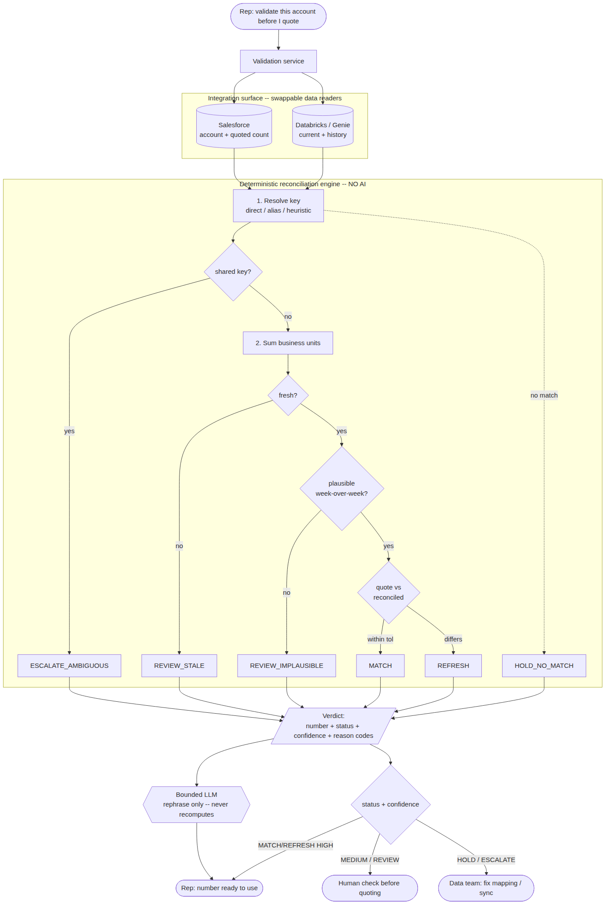

# Audience Reconciliation — Pre-Quote Validation

A portfolio demonstration by **Jakub Lazový** · [github.com/ZenNinja-Dev](https://github.com/ZenNinja-Dev)

[](https://zenninja-dev.github.io/audience-reconciliation/)
&nbsp;


[](LICENSE)

> **🔗 Live one-page showcase → https://zenninja-dev.github.io/audience-reconciliation/**
> The problem, the core design decision, and the results in a couple of minutes — no setup, nothing to run.

A small, runnable system that reconciles a **CRM-quoted number against a live
data-warehouse number** and tells a salesperson whether it's safe to put on a
contract — before a wrong number causes a pricing error.

The scenario is a fictional B2B SaaS vendor ("Meridian") that prices contracts by a
customer's **audience count**: Sales builds quotes in Salesforce, the live number
lives in Databricks, and the two drift apart. It's a generic pattern — the same design
applies to any "the CRM number and the source-of-truth number don't match, and it
feeds pricing" problem.

> **Note:** everything here runs on a **synthetic dataset** (`synthetic_data/`). No
> real company, customer, or system is involved.

The design decision that runs through the whole project: **counting is a rules problem
before it's ever an AI problem.** A deterministic, tested engine produces the number;
an optional, bounded LLM only phrases the result and never touches a figure.

---

## Architecture



The money-bearing path — data → engine → verdict — never passes through the model.

---

## Quick start

No dependencies, no API keys, no build step. Python 3.9+ standard library only.

```bash
git clone https://github.com/ZenNinja-Dev/audience-reconciliation.git
cd audience-reconciliation

# Validate every account and print the reconciliation report
python -m src.run

# Validate one account (the actual rep flow) — by key, CRM id, or name
python -m src.run --account ACC-2007
python -m src.run --account "Solaris"

# Machine-readable output
python -m src.run --json

# Run the eval suite (expected vs actual verdict for every account)
python -m eval.run_eval

# Run the unit tests
python -m unittest discover -s tests -v
```

Or use the Makefile: `make run`, `make eval`, `make test`, `make demo`.

Expected result of `python -m eval.run_eval`: **12/12 cases pass** — 6 accounts safe
to auto-use, 6 correctly held for a human.

---

## How it's structured (the write-ups)

The `docs/` folder walks through the thinking, not just the code:

| Document | What's in it |
|---|---|
| [🔗 **Live showcase**](https://zenninja-dev.github.io/audience-reconciliation/) | The hosted, non-technical one-pager — the same story, nothing to run |
| [`docs/part1_scope.md`](docs/part1_scope.md) | Clarifying questions, assumptions, success metrics, out-of-scope |
| [`docs/part2_design.md`](docs/part2_design.md) | The agent-vs-deterministic split, human-in-the-loop, model selection, integration surface, governance |
| [`docs/part2_architecture.mmd`](docs/part2_architecture.mmd) / [`.png`](docs/part2_architecture.png) | Architecture diagram |
| [`docs/part4_leadership_brief.md`](docs/part4_leadership_brief.md) | A one-page, non-technical pilot proposal |

---

## What the prototype actually handles

The dataset is deliberately dirty. Every one of these is caught and routed, not
silently mis-priced (full reasoning in [`eval/eval_cases.md`](eval/eval_cases.md)):

| Case | Account | Verdict |
|---|---|---|
| Clean match | Vantage, Ridgeline | `MATCH` — safe |
| Out-of-date quote, trustworthy data | Larkspur, Cobalt, Aperture | `REFRESH` — safe |
| Multi-BU account quoted as one figure (must **sum**) | Solaris (3 rows → 542,600) | `REFRESH` — safe |
| CRM/warehouse key drift after rebrand | Juniper (`ACC-2008` → `ACC-2008-OLD`) | `REFRESH` — **MEDIUM**, confirm mapping |
| No warehouse record | Everpeak | `HOLD_NO_MATCH` |
| Stale source data (54 days old) | Halcyon | `REVIEW_STALE` |
| Implausible ~50x week-over-week spike | Torch Digital | `REVIEW_IMPLAUSIBLE` — number withheld |
| Two accounts sharing one key | Sable Industries + Analytics | `ESCALATE_AMBIGUOUS` |

Only `MATCH` / `REFRESH` at **HIGH** confidence are ever auto-usable. Everything else
stops for a human — a wrong count feeds a wrong price, so the expensive failure is a
false "safe," and the system is built to avoid exactly that.

---

## Repo structure

```
src/
  config.py     Business rules & thresholds (the only place they live)
  models.py     Typed structures + Status / Confidence enums
  data.py       CSV loaders — the ONLY thing that changes for real Salesforce/Databricks
  engine.py     Deterministic reconciliation. Zero AI. The heart of the project.
  explain.py    Bounded AI narration layer — pluggable, template fallback, never recomputes
  run.py        CLI / on-demand validation entrypoint
prompts/
  explain_discrepancy_v1.md   Retired first-pass prompt (kept for the record)
  explain_discrepancy_v2.md   Active prompt — rephrase-only, cannot touch the number
  CHANGELOG.md                One-line-per-version notes on what changed and why
eval/
  eval_cases.json   Machine-readable expectations per account
  eval_cases.md     Reasoning + the found-and-fixed failure
  run_eval.py       Asserts engine output vs expectations (CI gate)
tests/
  test_engine.py    Focused unit tests (stdlib unittest)
synthetic_data/     The synthetic dataset + its README
docs/               Scope, design, architecture diagram, leadership brief
```

---

## Optional: wiring a real LLM

The narration layer runs on a deterministic template by default so the prototype is
fully reproducible offline. To use a real model instead:

```bash
# Local, private (no data leaves the machine)
export RECON_LLM_PROVIDER=ollama RECON_LLM_MODEL=llama3.2
python -m src.run --account ACC-2004

# Hosted
export RECON_LLM_PROVIDER=anthropic RECON_LLM_MODEL=claude-3-5-haiku-latest
python -m src.run --account ACC-2004
```

The model only ever *rephrases* the engine's verdict; it cannot change a number,
status, or confidence. See [`prompts/CHANGELOG.md`](prompts/CHANGELOG.md) for why that
boundary is enforced.

---

## License

MIT — see [`LICENSE`](LICENSE).
