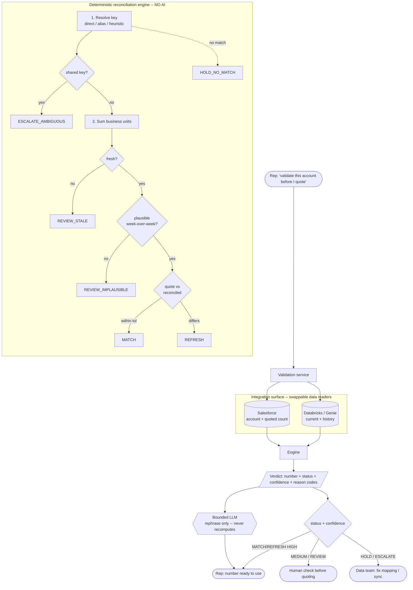

# Part 2 — Solution Design

*A portfolio demonstration by Jakub Lazový · reconciliation & pre-quote validation*

## The slice I chose

**On-demand pre-quote Audience validation.** A rep about to build or renew a quote
triggers one check for an account. The system returns a reconciled Audience count,
a confidence level, and a clear next action — *before* the number lands on a
contract.

**Why this slice.** The business pain is pricing errors and rework at the moment a
quote goes out. Validating *at that moment* attacks the pain directly, puts a
human at exactly the decision point where a wrong number costs money, and — as a
bonus — naturally surfaces every messy data case (stale, missing, ambiguous,
implausible) because it runs per account against live data. A nightly full-account
sync is the complementary v2 (it makes the number ambient), but on-demand
validation is where trust is won first: it's opt-in, low-blast-radius, and every
run produces a visible right-or-wrong signal reps can judge.

## Agent vs. deterministic workflow — the central design call

The instinct on hearing "have AI pull the number" is to point a model at the data
and ask it for the count. That is the wrong architecture, and the mock dataset
shows why: it contains a 50x week-over-week spike (Torch Digital), a one-to-many key
(Sable ×2 → one row), a summed multi-unit account (Solaris), and a rebrand key
drift (Juniper). Every one of those is a **rules** decision with a right answer
and real money attached. A language model asked to "figure out the count" will
occasionally average when it should sum, or confidently rationalise a garbage
value — I saw exactly that in prompt v1 (see `prompts/CHANGELOG.md`).

So the split is:

| Concern | Type | Where it lives |
|---|---|---|
| Resolve Salesforce → Databricks key (direct / alias / heuristic) | **Deterministic** | `engine._resolve_dbx_key` |
| Detect shared / ambiguous keys | **Deterministic** | `engine` step 1 |
| Sum business-unit rows | **Deterministic** | `engine` step 3 |
| Freshness check vs threshold | **Deterministic** | `engine` step 4 |
| Plausibility (week-over-week anomaly) | **Deterministic** | `engine._plausibility` |
| Confidence + verdict (MATCH/REFRESH/HOLD/…) | **Deterministic** | `engine` step 6 |
| Explain the verdict to a rep in plain language | **Non-deterministic (LLM)** | `explain.py` |
| Draft the escalation message to the data team | **Non-deterministic (LLM)** | `explain.py` |
| (roadmap) Natural-language "what's the audience for X?" query | **Non-deterministic (Genie)** | integration layer |

**The number is never produced by a model.** The LLM only phrases a decision the
rules already made. This is the single most important architectural choice in the
project: counting is a rules problem before it is ever an AI problem.

## Where the human sits, and what happens on failure / low confidence

The engine returns one of six statuses; only two are ever auto-usable:

- **MATCH / REFRESH at HIGH confidence** → the number is surfaced to the rep as
  ready-to-use (REFRESH also proposes the updated figure). The rep still clicks to
  apply it — we recommend, a human commits.
- **REFRESH at MEDIUM confidence** (mapping inferred via alias/heuristic, e.g.
  Juniper) → number shown, but flagged "confirm the account mapping first." Not
  auto-safe.
- **REVIEW_STALE** (e.g. Halcyon, 54 days old) → best-available number shown but
  marked unconfirmed; rep must refresh/verify.
- **REVIEW_IMPLAUSIBLE** (e.g. Torch's 50x spike) → **no number returned**; the
  engine states the last trusted value and routes to the data team.
- **HOLD_NO_MATCH** (e.g. Everpeak, no warehouse row) → cannot validate; blocked
  from auto-fill, sync/mapping check requested.
- **ESCALATE_AMBIGUOUS** (e.g. Sable ×2 sharing a key) → cannot attribute; the data
  team must split the key before any per-account number is trustworthy.

The failure philosophy: **when the system is unsure, it says so and stops — it
never emits a confident wrong number.** A wrong count feeds a wrong price, so the
expensive failure is a false "safe," not a false "needs review." Every threshold
that draws that line lives in `src/config.py` as reviewable business config.

## Model selection and trade-offs

| Step | Tool | Why / trade-off |
|---|---|---|
| Fetch current + historical Audience rows | **Databricks SQL / Genie** | Genie's NL-to-SQL is convenient for ad-hoc "audience by account" questions, but for the production path I'd pin a **reviewed, parameterised SQL query** behind it — a hallucinated `WHERE`/`GROUP BY` on a pricing query is unacceptable. Genie is for exploration; deterministic SQL for the money path. |
| Reconciliation / counting | **No model — Python rules** | Correctness, auditability, zero token cost, sub-millisecond latency. |
| Explain verdict to rep + draft escalation | **Small, fast LLM (e.g. Claude Haiku / Gemini Flash)** | Output is 1–2 sentences of rephrasing bounded facts. Cheap, low-latency, and low-risk because the model can't touch the number. No need for a frontier model here. |
| (roadmap) Ambiguous-mapping suggestions | **Mid-tier LLM, human-confirmed** | Could *propose* which account a shared key belongs to from notes, but only as a suggestion a human approves — never an auto-apply. |

The guiding rule: **spend model capability only where the task is genuinely
fuzzy** (language), and keep it cheap because the fuzzy task is small. The
expensive, exact work is code.

## Integration surface

- **Salesforce** (account, `customer_key`, `last_quoted_audience_count`, quote/
  renewal dates): read via report/API pull. Write-back is out of scope for v1 —
  the rep applies the recommendation. Rate limits and API quotas matter at
  batch/sync scale; for on-demand single-account checks the volume is low.
- **Databricks / Genie** (current + history Audience): the highest-risk surface.
  Needs retries with backoff on the warehouse, a query timeout, and a hard rule
  that a failed/empty result becomes **HOLD**, never a silent zero. Account-mapping
  mismatches are handled explicitly (alias table + escalation), not swallowed.
- **LLM provider**: pluggable; the narration layer degrades to a deterministic
  template if the provider is unavailable, so an LLM outage never blocks a quote
  (implemented — `explain.py`).

In the prototype these three surfaces are the CSV loaders in `src/data.py`; they
are the only components that change when moving to real systems. Everything
downstream is source-agnostic and unit-tested.

## Data governance — what a reviewer would want to see

- **Access control:** the tool reads only the account a rep is entitled to quote;
  it inherits Salesforce/Databricks row-level permissions rather than holding a
  god-mode service account. No customer PII is needed — only aggregate audience
  counts and account metadata.
- **Provenance & freshness:** every verdict records the Databricks key actually
  used, the business-unit breakdown, the source record age, and the reason codes
  behind the decision (see the JSON output). A governance reviewer can trace any
  number back to the rows and rules that produced it.
- **No silent trust:** stale or unverifiable data is labelled, not hidden. The
  system's default on uncertainty is to withhold, which is the governance-friendly
  failure mode.
- **Auditability:** rules and thresholds are versioned config; prompts are
  versioned artifacts; the eval suite pins expected behaviour so a change in any
  verdict is visible in review.

## Architecture diagram

Source: [`part2_architecture.mmd`](./part2_architecture.mmd). Rendered:

**Reading the diagram:** data flows in from two swappable sources, through a
pure-rules engine that emits a verdict, which is then (a) narrated by a bounded
LLM and (b) gated by status+confidence into one of three destinations — ready to
use, human check, or data-team escalation. The money-bearing path never passes
through the model.
